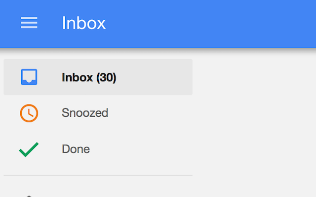

# Inbox ToDo Count

>  Shows the number of items in the Google Inbox

Unlike other extensions this includes all (not only unread mail) and tasks. Handy if you use Inbox as your todo list and want to see how much you still have to complete.

Download it from the [Chrome Web Store](https://chrome.google.com/webstore/detail/inbox-todo-count/ceaelmbokkdabmijonojglkmkebimhfk)

Feedback is very much appreciated at [@schuon](https://twitter.com/schuon)

Contributors:
- [bfred-it](https://github.com/bfred-it)
